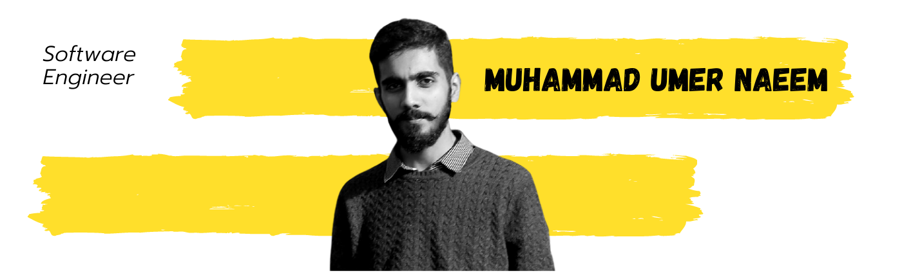

<h1 align="center">
  
</h1>

 
 
    

<h2>⚡️ A Few Quick Facts</h2>
<ul>
<li>🔭 I’m currently working in <a href="https://www.systemsltd.com/">Systems Ltd</a>.</li>
<li>🧐 Learning about <strong>machine learning</strong>, <strong>computer graphics</strong>, and a bit of <strong>data sciences</strong>.</li>
<li>👨‍💻 Most of my projects are available on <a href="https://github.com/umernaeem217">Github</a>.</li>
<li>📝 I regulary write articles on <a href="https://www.digitalfuge.com/blog/">my blog</a>.</li>
<li>💬 Ping me about <strong>asp.net, dotnet core, angular, and cloud stuff</strong>.</li>
<li>📙 Check out my <a href="https://www.digitalfuge.com/wp-content/uploads/2021/10/MuhammadUmerNaeemResume.pdf">resume</a>.</li>
<li>🎉 Fun Fact: It took less code to send a man to space than to run a smartphone!</li>
</ul>
 
<h2>🚀 Tools & Technologies I Use</h2>

        

       

  

  

  

<h2>🌱 Stats</h2>

  

    
    
  

           
  

    
  

   
  

<h2>✒️ Recent Posts</h2>

<!-- MEDIUM:START --> 
<!-- MEDIUM:END -->